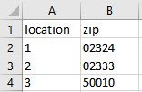
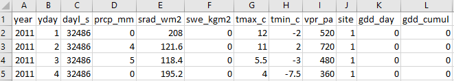

# DaymetRShiny
A shiny app that allows users to access interpolated historical weather data
 
Available online at buzzee.shinyapps.io/DaymetRShiny

## What is Daymet?

Daymet is software that takes inputs from multiple ground-based weather stations and outputs estimated daily maximum and minimum temperature, precipitation, humidity, day length, snow weight equivalence, and solar radiation for locations outside the coverage area of any one particular weather station. This gives researchers interested in remote locations access to important meteorological data dating back to 1980.

## The App
This app provides easy access to the data produced by Daymet. It features an easy to use point-and-click interface that requires no prior programming knowledge to navigate. Users are given the option to identify locations with either latitude and longitude, or zip code, and all the data from each location is compiled into a single csv file for download.

## Inputs

Users will need to upload a file containing a column for location id (text or number) and either a column for zipcode or separate columns for latitude and longitude. For example,

## Output

Embedded is an interactive plot for basic exploration and a csv file of the following format is available to download.

  

